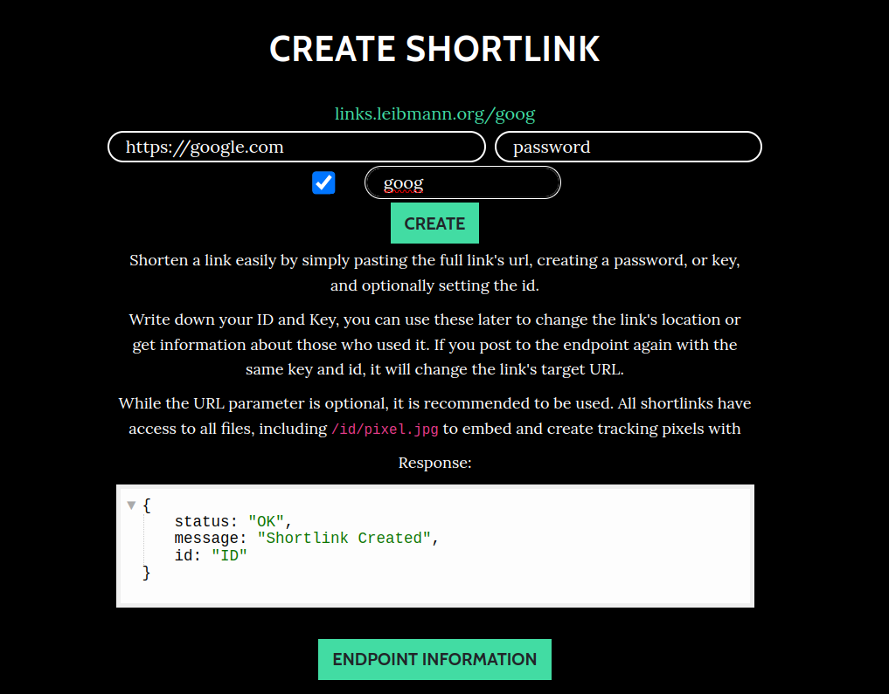
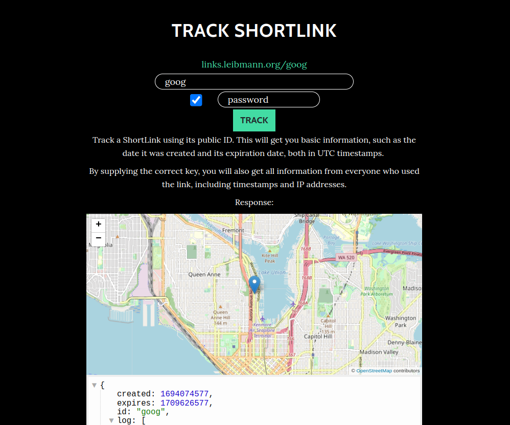

# ShortUrls: Trackable Links

[]([https://](https://github.com/Pop101/ShortUrls/issues))

# Table of Contents

- [ShortUrls: Trackable Links](#shorturls-trackable-links)
- [Table of Contents](#table-of-contents)
- [Overview](#overview)
- [Technologies](#technologies)
- [Getting Started](#getting-started)
- [Usage](#usage)

# Overview

Fingerprinting is an increasingly prominent technique used across the web to assign each user a unique ID.
I built this project mainly to explore common fingerprinting techniques without using an external library while
still demonstrating how easy it is to track users.

Try it out at [https://links.leibmann.org](https://links.leibmann.org)!

# Technologies

This project is created with:

- [Flask](https://flask.palletsprojects.com/en/2.2.x/): 2.2.2
- [Waitress](https://docs.pylonsproject.org/projects/waitress/en/stable/): 1.4.4
- [GeoLite 2](https://dev.maxmind.com/geoip/geolite2-free-geolocation-data)
- [SQLite](https://www.sqlite.org/index.html)
- [AP Scheduler](https://apscheduler.readthedocs.io/en/stable/): 3.9.0
  
# Getting Started

Self-hosting the site is easy

First, ensure you have poetry installed \
```sudo python3 -m pip install poetry```

Now, clone the repo and install the dependencies \
```
git clone https://github.com/Pop101/ShortUrls
cd ShortUrls
poetry install
```

Finally, run the webserver \
```poetry run python3 webserver.py```

# Usage

Just connect to the webserver, creating links and tracking can be done through the website itself \
```http://localhost:8484```



Tracking can be just as easy! Note, for most information, you need to input the same
passkey you used for link creation!


